**Zero trust in micro-services architecture**
=============================================

Introduction
------------

In the ever-evolving landscape of modern software architecture, microservices
have emerged as a powerful paradigm that enables the development of complex
applications by breaking them down into smaller, more manageable components.
This approach fosters agility, scalability, and ease of deployment. However, the
benefits of microservices also come with unique challenges, particularly in
terms of security—specifically, the challenge lies in securing the communication
between these distributed microservices.

Unlike traditional monolithic systems, where communication often occurs within a
single, tightly integrated server, microservices architecture distributes
functionalities across various independently deployed services. As a result, the
interactions between microservices must traverse the network, exposing potential
security vulnerabilities. This shift from a centralized communication model to a
distributed one introduces a critical need for encryption and data protection,
which is where Mutual TLS (mTLS) steps in.

In this article, we'll delve into the symbiotic relationship between mTLS and
microservices architecture. We'll explore what mTLS is, why it's crucial for
securing inter-microservices communication, and how it can be effectively
implemented to ensure robust protection for your distributed applications. We
will also get our hands dirty implementing a simple micro-services based zero
trust example.

 

Embracing zero trust**​**
------------------------

What comes to your mind when the word security is mentioned? For me, it evokes
the images of firewalls and demilitarised zones sprawling at the edge of
networks creating a perimeter. Within this perimeter is the safe-zone where data
and application can freely interact to solve business problems. Unfortunately,
perimeter-based security is no longer sufficient to protect against advanced
cyber threats, the concept of Zero Trust has gained significant traction. Zero
Trust is a security framework that challenges the traditional notion of "trust
but verify." Instead, it operates on the principle of "never trust, always
verify."

In the context of microservices, the Zero Trust model asserts that no entity,
whether internal or external, should be inherently trusted. This philosophy is
especially relevant as microservices frequently communicate across network
boundaries, making them susceptible to attacks. In a Zero Trust environment,
access to resources and services is granted based on continuous authentication,
strict access controls, and comprehensive visibility into network traffic.

 

Understanding Mutual TLS (mTLS)
-------------------------------

Transport Layer Security (TLS) is a cryptographic protocol that provides secure
communication over a computer network, commonly associated with securing web
traffic through HTTPS. In the context of microservices architecture, Mutual TLS,
often abbreviated as mTLS, extends the principles of TLS to secure the
communication between different microservices.

 

### mTLS and zero trust

In the Zero Trust model, entities (external and internal) are continuously
authenticated before being granted access to resources. mTLS facilitates this
principle by ensuring that both the client and server micro-services are
authenticated through digital certificates before any data exchange occurs. This
authentication extends beyond the initial handshake, as mTLS mandates that both
parties consistently present valid certificates throughout the communication
session. This way, micro-services adhere to the "never trust, always verify"
tenet of Zero Trust.

At the intersection of Zero Trust and mTLS lies a multi-layered security
approach that aligns well with the distributed nature of microservices. Zero
Trust advocates continuous verification and access controls, while mTLS ensures
that only trusted microservices can communicate, and that this communication
remains confidential and unaltered.

 

### The Basics of TLS

Before diving into mTLS, it's essential to understand the basics of TLS. TLS is
a protocol that establishes an encrypted and authenticated connection between
two parties, typically a client (such as a web browser) and a server. It ensures
that the data exchanged between them remains confidential, integral, and secure
from eavesdropping and tampering.

In a typical TLS setup, the server presents its digital certificate to the
client, allowing the client to verify the server's identity. Once the server's
identity is confirmed, a secure channel is established, and the client and
server can exchange data encrypted so that only the intended recipient can
decrypt it.

In the context of microservices, mTLS takes the concept of traditional TLS a
step further by introducing mutual authentication. Unlike one-way TLS, where
only the server's identity is verified by the client, mTLS involves both the
server and the client authenticating each other. This two-way authentication
adds a new layer of trust and security to the communication channel.

In a mTLS setup, both the client and the server possess digital certificates.
When a microservice (acting as a client) attempts to communicate with another
microservice (acting as a server), both parties present their certificates to
each other. This exchange enables both sides to validate the identity of the
other party before any data is transmitted.

 

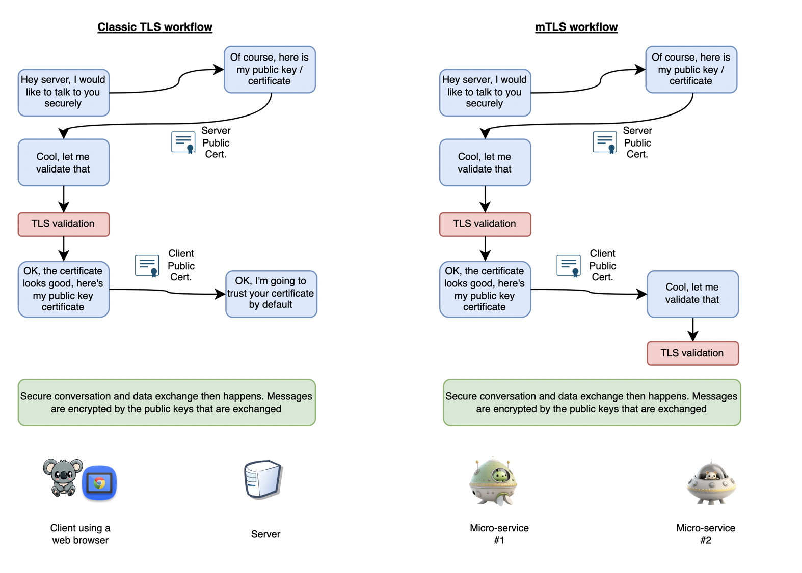

 

Getting our hands dirty
-----------------------

Let us set the stage for our implementation. We will be developing a set of
micro-services, one talking to another through mTLS. To facilitate this, we will
be using a framework called DAPR. DAPR will deploy a sidecar component into our
micro-service and, through this side car component, implement mTLS.

 

### The sidecar pattern

Due to the nature of compatibility of micro-services, more often than not, we
will have a primary micro-service reusing common functionalities offered by the
runtime platform. While the primary microservice handles the core logic, it can
be complemented by additional functionalities like authentication, logging,
monitoring, or security enforcement. This is where the sidecar design pattern
comes into play.

The advantage of a sidecar is that it does have to be explicitly developed by
our engineers. Rather sidecars are often open source libraries that can be
injected into our micro-services at deployment time. Our own engineers does not
have directly care nor support these implementation and can then focus on
solving business problems rather than plumbing.

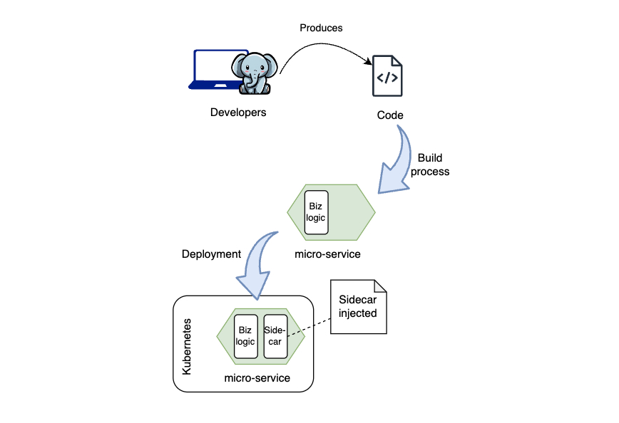

 

### Sidecar and mTLS

A sidecar devoted to security tasks can play a pivotal role in implementing
mTLS. This security sidecar operates alongside each microservice that requires
secure communication, providing the necessary encryption, decryption, and
certificate management functionalities. By isolating security concerns from the
primary micro-service logic, the sidecar ensures that encryption and
authentication become transparent and consistent across the micro-services
ecosystem. Below are a few things a sidecar

 

1.  **Certificate Management:** The security sidecar can be responsible for
    generating, distributing, and managing digital certificates required for
    mTLS authentication. It handles certificate renewal, registration with
    Certificate Authorities (CAs), and certificate storage. All these are
    automated and transparent to the developers.

2.  **Handshake and Encryption:** When a microservice initiates communication
    with another, the security sidecar handles the TLS handshake, establishing a
    secure channel between the microservices. The sidecar encrypts and decrypts
    the data exchanged, ensuring that only authorized parties can access the
    content.

3.  **Authentication:** The security sidecar verifies the authenticity of both
    the sending and receiving microservices. It ensures that each party's
    certificate is valid and trusted, enforcing mutual authentication as per the
    principles of mTLS.

4.  **Traffic Control and Policy Enforcement:** Beyond encryption and
    authentication, the security sidecar can enforce access policies and traffic
    control. It can determine which microservices are allowed to communicate
    with each other, thus enhancing access controls and aligning with the Zero
    Trust model.

5.  **Logging and Auditing:** The security sidecar can log communication
    details, certificate validations, and any security-related events. These
    logs contribute to monitoring, auditing, and incident response efforts,
    bolstering the overall security posture.

 

Specifically to mTLS, what sidecar would do is to intervene between two
communicating micro-service and envelop the communication traffic with HTTPS
while leaving the internal inter-container communication to remain as HTTP. This
will mean that the engineer developing the micro-service do not need to care
about HTTPS, TLS, mTLS or certificate management. The engineers can use plain
old and simple HTTP and let the sidecar envelop the traffic with HTTPS only at
runtime. This simplifies development time troubleshooting and testing and yet
allow security to still be implemented during production.

 

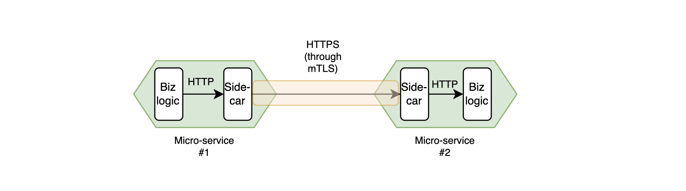

 

### Introducing Distributed Application Runtime (Dapr) 

We will let Dapr introduce itself :)

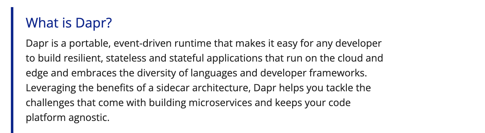

We will leverage Dapr to implement the sidecar pattern and mTLS.

 

### Getting Kubernetes ready

-   Firstly, get Kubernetes installed. The easiest way to doo that for a
    development machine is to use Docker Desktop. We find that this tutorial to
    be helpful
    <https://birthday.play-with-docker.com/kubernetes-docker-desktop/>

-   Next, we need to install Dapr into our Kubernetes environment. We use KiND
    (<https://kind.sigs.k8s.io/>) to help us install Dapr. Follow the tutorial
    here:\<
    https://docs.dapr.io/operations/hosting/kubernetes/cluster/setup-kind/\>

-   To ensure everything is ok, run the command below in a command line console
    and the result should show as such

 

~~~~~~~~~~~~~~~~~~~~~~~~~~~~~~~~~~~~~~~~~~~~~~~~~~~~~~~~~~~~~~~~~~~~~~~~~~~~~~~~
> dapr status -k
~~~~~~~~~~~~~~~~~~~~~~~~~~~~~~~~~~~~~~~~~~~~~~~~~~~~~~~~~~~~~~~~~~~~~~~~~~~~~~~~

 

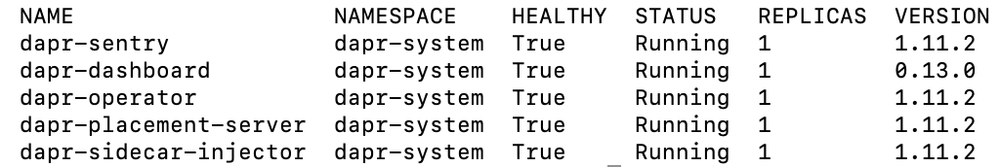

Once Kubernetes is configured with Dapr, we would expect any correctly
configured micro-service image deployed will get a sidecar injected into the
container.

 

### Developing our micro-services

Note: The full source code of these examples can be found here
<https://github.com/azrulhasni/dapr-account/tree/master>

 

We will develop two micro-services. One called `Payment`and the other called
`Account`. `Payment` will send `Transaction` information to `Account`.

 

Firstly create a Payment Spring Boot project using Spring Initializr

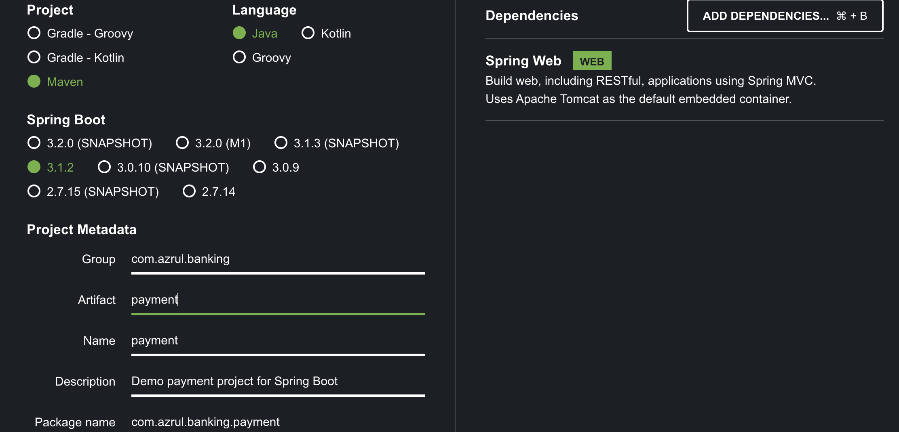

Do the same for Account

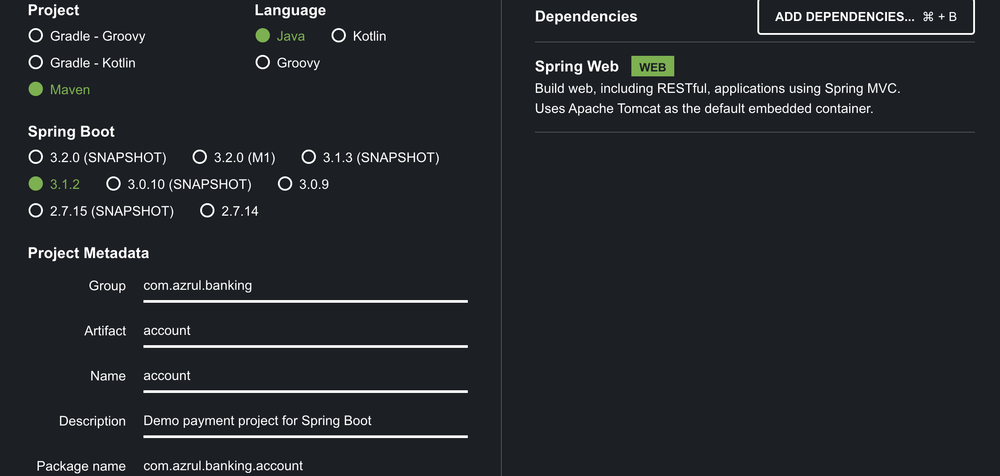

 

>   Make sure that Spring Web is added as a dependency

 

Firstly, let take a look at `Account`.

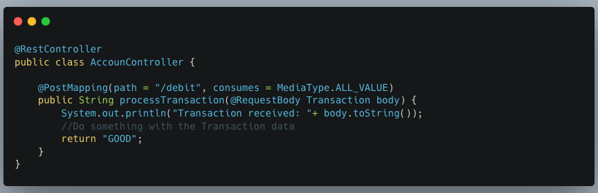

[<https://github.com/azrulhasni/dapr-account/blob/master/account/src/main/java/com/azrul/banking/account/AccounController.java>]

 

In this classic `RestController`, we will accept `Transaction` data on a service
called `/debit`and we will do something with it. In a typical banking
application, this service could be calling a Core Banking application to commit
the actual debiting of account.

But here’s the good thing:

Dapr is no where to be seen! This means that to support mTLS through Dapr, the
service portion of your application need not change.

 

Let us now focus on the caller micro-service:`Payment`

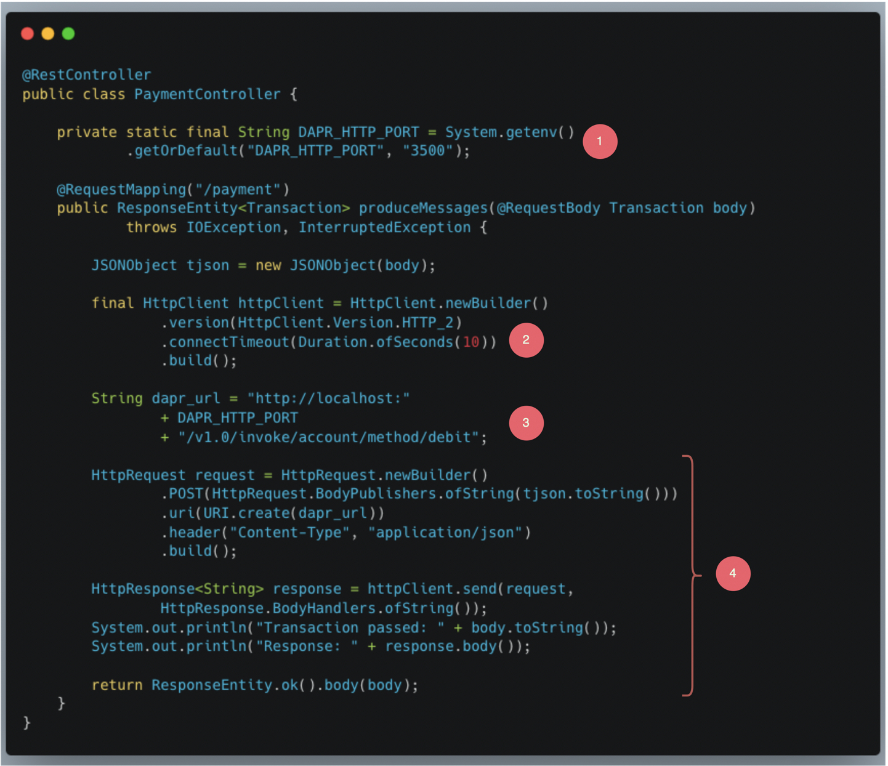

[<https://github.com/azrulhasni/dapr-account/blob/master/payment/src/main/java/com/azrul/banking/payment/PaymentController.java>]

 

Firstly, note that there is no Dapr specific library or code in the caller above
(Dapr comes with a Java SDK
<https://docs.dapr.io/developing-applications/sdks/java/>. In this tutorial, we
are showing how to use Dapr without the SDK.

The code above indicate how the micro-service `payment` is calling the
micro-service `account`on a service called `/debit`

 

1.  Dapr is deployed as a sidecar (i.e. a process) inside the container. To call
    the sidecar from the main micro-service, we would need to know the port.
    Dapr would actually register the port as an environment variable called
    `DAPR_HTTP_PORT`that we can query. By default, the port is 3500.

2.  We use plain old`java.net.HttpClient` to make a call to Dapr. No Dapr
    specific library needed

3.  As stated the paragraph Sidecar and mTLS, the connectivity between the main
    micro-service and Dapr is done on plain HTTP (instead of secure HTTPS) on
    `localhost`. This is because Dapr will intervene at runtime to envelop this
    HTTP request with HTTPS.

    The form of the URL though, is Dapr specific. The URL must be formulated as
    below:

 

~~~~~~~~~~~~~~~~~~~~~~~~~~~~~~~~~~~~~~~~~~~~~~~~~~~~~~~~~~~~~~~~~~~~~~~~~~~~~~~~
http://localhost:<Dapr port>/v1.0/invoke/<the service i.e. account>/method/<the path i.e. /debit>
~~~~~~~~~~~~~~~~~~~~~~~~~~~~~~~~~~~~~~~~~~~~~~~~~~~~~~~~~~~~~~~~~~~~~~~~~~~~~~~~

 

In our example, `account` is the name of the service. We will see later in
deployment where this service name must be specified.

 

1.  Once the URL is formulated, we will call it via `HttpClient` and process the
    response.

 

We will not be changing the port for the Account service and therefore not will
run on the default 8080 port.

 

### Testing our micro-services

Let us test our micro-services locally on our development machine. To test, we
will be running both our micro-services as plain old Java service on our local
machine. To emulate Dapr, we will use Dapr self-hosted

 

Let us go to the root directory of our Account service first and run it:

~~~~~~~~~~~~~~~~~~~~~~~~~~~~~~~~~~~~~~~~~~~~~~~~~~~~~~~~~~~~~~~~~~~~~~~~~~~~~~~~
> ./mvn spring-boot:run -Dspring-boot.run.jvmArguments=-Dserver.port=9090
~~~~~~~~~~~~~~~~~~~~~~~~~~~~~~~~~~~~~~~~~~~~~~~~~~~~~~~~~~~~~~~~~~~~~~~~~~~~~~~~

 

>   We are running the Account micro-service on port 9090\*\* only in test\*\*

 

If execution is successful, we will end up with a status like below:

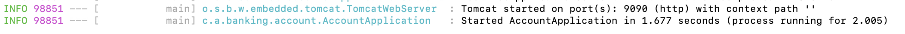

 

Then we need to install Dapr - the self-hosted version. On MacOS, we may want to
use home-brew to install it.

~~~~~~~~~~~~~~~~~~~~~~~~~~~~~~~~~~~~~~~~~~~~~~~~~~~~~~~~~~~~~~~~~~~~~~~~~~~~~~~~
> brew install dapr/tap/dapr-cli
~~~~~~~~~~~~~~~~~~~~~~~~~~~~~~~~~~~~~~~~~~~~~~~~~~~~~~~~~~~~~~~~~~~~~~~~~~~~~~~~

Installation oof Dapr on other platforms can be found here
[<https://docs.dapr.io/getting-started/install-dapr-cli/>]

 

Next we need to run Dapr to wrap our Account service. Fire up another command
line console and run:

~~~~~~~~~~~~~~~~~~~~~~~~~~~~~~~~~~~~~~~~~~~~~~~~~~~~~~~~~~~~~~~~~~~~~~~~~~~~~~~~
> dapr run --app-id account --app-port 9090 --dapr-http-port 3500
~~~~~~~~~~~~~~~~~~~~~~~~~~~~~~~~~~~~~~~~~~~~~~~~~~~~~~~~~~~~~~~~~~~~~~~~~~~~~~~~

This will run Dapr on port 3500

 

Now, let us go to the root directory of our Payment service first, fire another
command line console and run:

~~~~~~~~~~~~~~~~~~~~~~~~~~~~~~~~~~~~~~~~~~~~~~~~~~~~~~~~~~~~~~~~~~~~~~~~~~~~~~~~
> ./mvn spring-boot:run -Dspring-boot.run.jvmArguments=-Dserver.port=8080
~~~~~~~~~~~~~~~~~~~~~~~~~~~~~~~~~~~~~~~~~~~~~~~~~~~~~~~~~~~~~~~~~~~~~~~~~~~~~~~~

This will run our Payment service on port 8080. If all goes well, we should see
the status below:

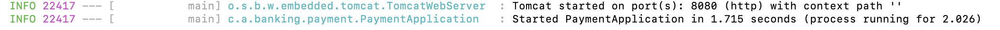

We can now use curl to test our services. In yet another command line console,
run:

~~~~~~~~~~~~~~~~~~~~~~~~~~~~~~~~~~~~~~~~~~~~~~~~~~~~~~~~~~~~~~~~~~~~~~~~~~~~~~~~
>  curl -d '{"from":"Zoro","to":"Nami","value":"123"}' -H "Content-Type: application/json" -X POST http://localhost:8080/payment
~~~~~~~~~~~~~~~~~~~~~~~~~~~~~~~~~~~~~~~~~~~~~~~~~~~~~~~~~~~~~~~~~~~~~~~~~~~~~~~~

This will send the `Transaction` to `/payment.` There, the Payment t service
will call the Account service via Dapr. In the console where the Account service
is run, we should see the same data being displayed:

This indicates that data pass from Payment to Account. Our test is successful.

 

### Pushing our micro-services to Docker Hub

In production, through CI/CD, we will push our code to a source code repository
and a build server will compile our code into Docker images and push it to
Docker Hub. The images in Docker Hub are going to be pulled back into the
Kubernetes cluster when we deploy the containers to production.

In our development environment (tutorial setup), we will still push our
containers to Docker Hub and we will pull them back into our Kubernetes cluster,
even if the images and cluster all reside on the same machine. This is to
emulate our production deployment as much as possible.

To do exactly this, if you do not have one, open an account Docker Hub
(https://hub.docker.com)

 

Before we can push our images, we need to change the pom.xml of our
micro-services first. Open the pom.xml file located in the \<Account root
directory\>/src/pom.xml and add the configuration items below. Where it says
`azrulhasni`, replace that with your own Docker Hub id.

 

~~~~~~~~~~~~~~~~~~~~~~~~~~~~~~~~~~~~~~~~~~~~~~~~~~~~~~~~~~~~~~~~~~~~~~~~~~~~~~~~
        ...      
        <plugins>
            ...
             <plugin>
                <groupId>com.google.cloud.tools</groupId>
                <artifactId>jib-maven-plugin</artifactId>
                <version>3.3.1</version>
                <configuration>
                    <from>
                        <image>eclipse-temurin:17.0.8_7-jre-jammy</image>
                    </from>
                    <to>
                        <image>azrulhasni/account</image>
                    </to>
                    <container>
                   <mainClass>com.azrul.banking.payment.AccountApplication</mainClass>
                    </container>
                </configuration>
            </plugin>
        </plugins>
~~~~~~~~~~~~~~~~~~~~~~~~~~~~~~~~~~~~~~~~~~~~~~~~~~~~~~~~~~~~~~~~~~~~~~~~~~~~~~~~

 

Do the same for Payment

~~~~~~~~~~~~~~~~~~~~~~~~~~~~~~~~~~~~~~~~~~~~~~~~~~~~~~~~~~~~~~~~~~~~~~~~~~~~~~~~
        ...      
        <plugins>
            ...
             <plugin>
                <groupId>com.google.cloud.tools</groupId>
                <artifactId>jib-maven-plugin</artifactId>
                <version>3.3.1</version>
                <configuration>
                    <from>
                        <image>eclipse-temurin:17.0.8_7-jre-jammy</image>
                    </from>
                    <to>
                        <image>azrulhasni/payment</image>
                    </to>
                    <container>
                   <mainClass>com.azrul.banking.payment.PaymentApplication</mainClass>
                    </container>
                </configuration>
            </plugin>
        </plugins>
~~~~~~~~~~~~~~~~~~~~~~~~~~~~~~~~~~~~~~~~~~~~~~~~~~~~~~~~~~~~~~~~~~~~~~~~~~~~~~~~

 

Then, fire up our command line console and point it to the root of the Account
service and run

~~~~~~~~~~~~~~~~~~~~~~~~~~~~~~~~~~~~~~~~~~~~~~~~~~~~~~~~~~~~~~~~~~~~~~~~~~~~~~~~
> mvn compile jib:build
~~~~~~~~~~~~~~~~~~~~~~~~~~~~~~~~~~~~~~~~~~~~~~~~~~~~~~~~~~~~~~~~~~~~~~~~~~~~~~~~

Do the same for the Payment service.

This command will compile our micro-services and push them to Docker Hub.

 

 

### Deploying our micro-services in Kubernetes

To deploy our micro-service to Kubernetes, we would need deployment manifests,
one for each service. Below are two deployment manifests for Account and Payment
services respectively. Copy these manifests and put them in the files
account-deployment.yml and payment-deployment.yml and save them in the root
directories of Account and Payment respectively. Again, replace `azrulhasni`with
your own Docker Hub id.

 

~~~~~~~~~~~~~~~~~~~~~~~~~~~~~~~~~~~~~~~~~~~~~~~~~~~~~~~~~~~~~~~~~~~~~~~~~~~~~~~~
apiVersion: apps/v1
kind: Deployment

metadata:
  name: account-deployment
  labels:
    run: account
    app: banking-account

spec:
  replicas: 1
  selector:
    matchLabels:
      run: account

  template:
    metadata:
      labels:
        run: account
        app: account
      annotations:
        dapr.io/enabled: "true"
        dapr.io/app-id: "account"
        dapr.io/app-port: "8080"
    spec:
      containers:
        - name: account
          image: azrulhasni/account
          ports:
            - containerPort: 8080
              protocol: TCP
          imagePullPolicy: Always
      restartPolicy: Always
      terminationGracePeriodSeconds: 30
      dnsPolicy: ClusterFirst
~~~~~~~~~~~~~~~~~~~~~~~~~~~~~~~~~~~~~~~~~~~~~~~~~~~~~~~~~~~~~~~~~~~~~~~~~~~~~~~~

 

~~~~~~~~~~~~~~~~~~~~~~~~~~~~~~~~~~~~~~~~~~~~~~~~~~~~~~~~~~~~~~~~~~~~~~~~~~~~~~~~
apiVersion: apps/v1
kind: Deployment

metadata:
  name: payment-deployment
  labels:
    run: payment
    app: banking-payment

spec:
  replicas: 1
  selector:
    matchLabels:
      run: payment

  template:
    metadata:
      labels:
        run: payment
        app: banking-payment
      annotations:
        dapr.io/enabled: "true"
        dapr.io/app-id: "payment"
        dapr.io/app-port: "8080"
    spec:
      containers:
        - name: payment
          image: azrulhasni/payment
          ports:
            - containerPort: 8080
              protocol: TCP
          imagePullPolicy: Always
      restartPolicy: Always
      terminationGracePeriodSeconds: 30
      dnsPolicy: ClusterFirst
~~~~~~~~~~~~~~~~~~~~~~~~~~~~~~~~~~~~~~~~~~~~~~~~~~~~~~~~~~~~~~~~~~~~~~~~~~~~~~~~

 

Note: Both services are running on the port 8080 (default Spring Boot port). As
we indicated before, the port 9090 for Account is only for test.

Note: The property `dapr.io/app-id` is where we put the service name. Recall
that we would need the service name to formulate the URL we use to call the
service through its sidecar.

 

To pull the Account service to our Kubernetes cluster, run:

~~~~~~~~~~~~~~~~~~~~~~~~~~~~~~~~~~~~~~~~~~~~~~~~~~~~~~~~~~~~~~~~~~~~~~~~~~~~~~~~
> kubectl apply -f account-deployment.yml 
~~~~~~~~~~~~~~~~~~~~~~~~~~~~~~~~~~~~~~~~~~~~~~~~~~~~~~~~~~~~~~~~~~~~~~~~~~~~~~~~

Do the same for Payment

~~~~~~~~~~~~~~~~~~~~~~~~~~~~~~~~~~~~~~~~~~~~~~~~~~~~~~~~~~~~~~~~~~~~~~~~~~~~~~~~
> kubectl apply -f payment-deployment.yml 
~~~~~~~~~~~~~~~~~~~~~~~~~~~~~~~~~~~~~~~~~~~~~~~~~~~~~~~~~~~~~~~~~~~~~~~~~~~~~~~~

 

To verify if the deployments are successful, run the command below

~~~~~~~~~~~~~~~~~~~~~~~~~~~~~~~~~~~~~~~~~~~~~~~~~~~~~~~~~~~~~~~~~~~~~~~~~~~~~~~~
> kubectl get poods
~~~~~~~~~~~~~~~~~~~~~~~~~~~~~~~~~~~~~~~~~~~~~~~~~~~~~~~~~~~~~~~~~~~~~~~~~~~~~~~~

We should see the status as per below

 

 

### Testing services in Kubernetes

Now let us test the services we deploy, the way we are going to do this test is
by opening a port directly into the micro service (Payment) itself. Of course,
this is done for testing purpose only. In a real-world scenario, traffic must
come through a proper Ingress gateway.

 

1.  We will call the sidecar of our Payment service from a console. By default,
    the sidecar port is 3500

2.  The Payment sidecar will forward our call to the actual business logic of
    Payment

3.  In Payment, we will call Account through Account’s sidecar

4.  Account’s sidecar, upon invocation by Payment sidecar, will forward the
    request to Account for further processing

 

To open the port to the Payment container directly, we need to run the command
below:

~~~~~~~~~~~~~~~~~~~~~~~~~~~~~~~~~~~~~~~~~~~~~~~~~~~~~~~~~~~~~~~~~~~~~~~~~~~~~~~~
> kubectl port-forward --namespace default payment-deployment-dcb84f4fb-j2tzt  3500
~~~~~~~~~~~~~~~~~~~~~~~~~~~~~~~~~~~~~~~~~~~~~~~~~~~~~~~~~~~~~~~~~~~~~~~~~~~~~~~~

 

Note: The parameter `payment-deployment-dcb84f4fb-j2tzt` is the pod name taken
from the command `kubectl get pods`above. Chances are, the food name in your
system will be different. Copy the correct pod name from the result.

 

Next, run the curl command :

~~~~~~~~~~~~~~~~~~~~~~~~~~~~~~~~~~~~~~~~~~~~~~~~~~~~~~~~~~~~~~~~~~~~~~~~~~~~~~~~
> curl -d '{"from":"Name","to":"Zoro","value":"444888"}' -H "Content-Type: application/json" -X POST http://localhost:3500/v1.0/invoke/payment/method/payment
~~~~~~~~~~~~~~~~~~~~~~~~~~~~~~~~~~~~~~~~~~~~~~~~~~~~~~~~~~~~~~~~~~~~~~~~~~~~~~~~

 

To see the result, we need to see the log of the Account micro-service as per
below:

~~~~~~~~~~~~~~~~~~~~~~~~~~~~~~~~~~~~~~~~~~~~~~~~~~~~~~~~~~~~~~~~~~~~~~~~~~~~~~~~
> kubectl logs account-deployment-bc9c48674-q4dl8 account
~~~~~~~~~~~~~~~~~~~~~~~~~~~~~~~~~~~~~~~~~~~~~~~~~~~~~~~~~~~~~~~~~~~~~~~~~~~~~~~~

Again, the parameter `account-deployment-bc9c48674-q4dl8` comes from the command
`kubectl get pods`

At the last line of the log, we will see the transaction we have sent:

With this, we conclude that the communication between Payment and Account is
successful

 

### Where is mTLS in all this?

How do we know the communication is done in mTLS? It is enough to open up Dapr
configuration using the command line below:

~~~~~~~~~~~~~~~~~~~~~~~~~~~~~~~~~~~~~~~~~~~~~~~~~~~~~~~~~~~~~~~~~~~~~~~~~~~~~~~~
> kubectl get configurations/daprsystem --namespace dapr-system -o yaml
~~~~~~~~~~~~~~~~~~~~~~~~~~~~~~~~~~~~~~~~~~~~~~~~~~~~~~~~~~~~~~~~~~~~~~~~~~~~~~~~

And to inspect the configuration file. At almost the end, we will find the
configuration below:

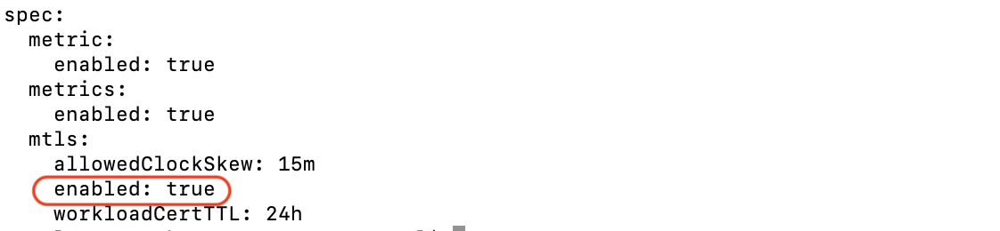

This indicates that TLS has already been enabled and inter-micro-services
traffic is encrypted with self-signed certificates. For more on Dapr and mTLS,
visit the link [<https://docs.dapr.io/operations/security/mtls/>]

 

 

 

Conclusion
----------

With this, we conclude that:

-   Zero trust is essential to ensure security beyond basic perimeter security

-   Zero trust in micro-services architecture is achieved using mTLS

-   mTLS can easily be implemented using Dapr
